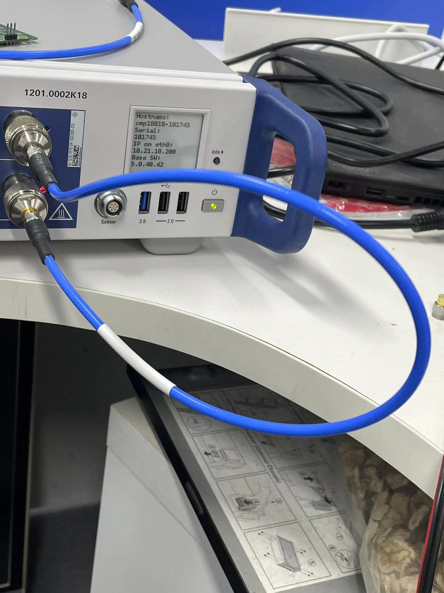

### short cable

|Freq MHz |	Loss dB	|	
|-------- | -----|
|2442|	0.48|		
|5210|	1.8	|	
|5290|	1.97|		
|5530|	1.8	|	
|5610|	1.94|		
|5690|	1.66|		
|5775|	1.98|		
|5985|	1.9	|	
|6065|	1.96|		
|6145|	1.97|		
|6225|	2.07|		
|6305|	2.11|		
|6385|	2.21|		
|6465|	2.12|		
|6545|	2.08|		
|6625|	1.98|		
|6705|	1.89|		
|6785|	1.67|		
|6865|	1.68|		
|6945|	1.78|		
|7025|	2	|	
|7095|	2.22|		
